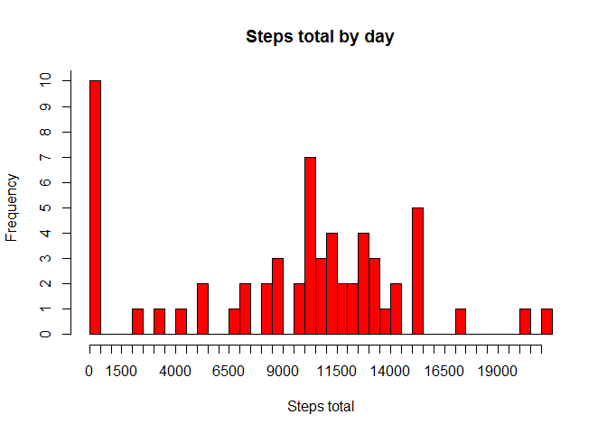
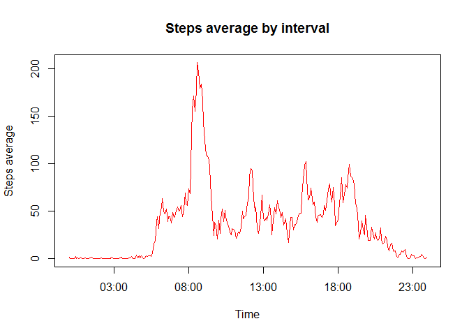
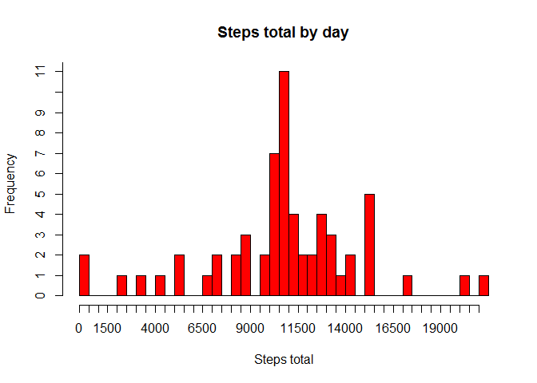
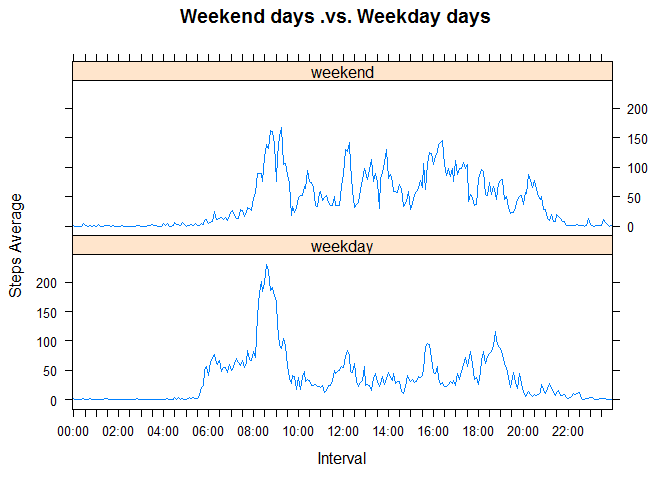

# Reproducible Research: Peer Assessment 1


## Loading and preprocessing the data

### Loading data

Our data are stored in a zip file called "activity.zip". For load data and start
the analisys we use "load.data()" and "unzip.file" functions:


```r
################################################################################
### unzip.file(filename, selected_file, path, force_unzip)                   ### 
################################################################################
#                                                                              #       
# This function unzip the file "filename" into "path" folder and               #
# return a vector with its names. If you have unzipped above does not unzip    #
# the file unless the parameter "force_unzip" is true.                         #
# The paramaters of function are:                                              #
#                                                                              #
# - filename: Filename of the zip file.                                        #
# - selected_file: Data file to unzip.                                         #      
# - path: Work directory.                                                      #
# - force_unzip: If TRUE the file is unzipped even if one exists in the        #
#   destination folder.                                                        #
#                                                                              #
################################################################################

unzip.file <- function (filename, selected_file, path, force_unzip){
     
     full_filename = paste(path,"/",filename,sep = "")
     full_data_filename = paste(path,"/",selected_file, sep="")
     
     # checking if the unzipped files exist or "force_unzip" is TRUE and must be
     # unzipped.
     if ((!file.exists(full_data_filename)) | (force_unzip)){
          
          # Unzip zip file
          unzip(full_filename, files=selected_file, exdir=path,
                overwrite=force_unzip)
     }     
     
     # Return the unzipped files
     return (full_data_filename)
}

################################################################################
### load.data(zip_file, data_file, work_path, force_unzip, separator,        ###     
###           na_string)                                                     ###
################################################################################
#                                                                              #       
# This function unzip "data_file" from "zip_file" and return a dataframe       # 
# variable with the data readed from it. "zip_file" is in "work_path" directory#
# The paramaters of function are:                                              #
#                                                                              #
# - zip_file: The zip file name.                                               #
# - data_file: The data file name.                                             #
# - work_path: Folder for zip and unzip files.                                 #
#              Default value = "./data"                                        #      
# - force_unzip: If TRUE the file is unzipped even if one exists in the        #
#   working folder.                                                            #
#              Default value = FALSE                                           #      
# - separator: Character that determine the end of a field and the beginning of#
#   the next.                                                                  #
#              Default value = ";"                                             #      
# - na_strings: Character that identify the fields with not available          #
#   information.                                                               #
#              Default value = ""                                              #      
#                                                                              #
################################################################################

load.data <- function (zip_file,
                       data_file,
                       work_path = "./data",
                       force_unzip = FALSE,
                       separator = ",",
                       na_strings = "NA"){
     
     # Unzip file
     full_data_file <- unzip.file(zip_file,
                                  data_file,
                                  work_path,
                                  force_unzip)
     
     # Read raw data
     raw_data <- read.csv(full_data_file,
                          sep = separator,
                          na.strings = na_strings,
                          stringsAsFactors = FALSE,
                          colClasses = c("integer","Date","character"),
                          row.names = NULL)
     
     # Return data
     return(raw_data)
}
```

And call it in this way:


```r
activity_data <- load.data("activity.zip","activity.csv")
```

These are a few observations from activity_data dataset


```r
head(activity_data,15)
```

```
##    steps       date interval
## 1     NA 2012-10-01        0
## 2     NA 2012-10-01        5
## 3     NA 2012-10-01       10
## 4     NA 2012-10-01       15
## 5     NA 2012-10-01       20
## 6     NA 2012-10-01       25
## 7     NA 2012-10-01       30
## 8     NA 2012-10-01       35
## 9     NA 2012-10-01       40
## 10    NA 2012-10-01       45
## 11    NA 2012-10-01       50
## 12    NA 2012-10-01       55
## 13    NA 2012-10-01      100
## 14    NA 2012-10-01      105
## 15    NA 2012-10-01      110
```
### Preprocesing data

We note that intervals are encoded in a particular way. Look at rows 12 and 13.


```r
activity_data[c(12,13),]
```

```
##    steps       date interval
## 12    NA 2012-10-01       55
## 13    NA 2012-10-01      100
```

Interval from row 12 correspond with 00:55 hours and interval from row 13
correspond with 01:00 hours, so we can say that the two first digits (from right
to left) represent minutes and the next two digits represent hour.

Other interesting thing is that interval counter start and finish every day.


```r
library(plyr)

head(ddply(activity_data,.(date), summarise, max_interval = max(as.integer(interval)),
           min_interval = min(as.integer(interval))),5)
```

```
##         date max_interval min_interval
## 1 2012-10-01         2355            0
## 2 2012-10-02         2355            0
## 3 2012-10-03         2355            0
## 4 2012-10-04         2355            0
## 5 2012-10-05         2355            0
```

The interval format is not the best for graphics, so we will change it to a time 
format (HH:MM:SS). The "interval.to.time()" function performs this task.


```r
################################################################################
### interval.to.time(interval_field)                                         ###
################################################################################
#                                                                              #       
# This function transform interval data in time (HH:MM:SS) data and return     #
# transformed data.                                                            #
# The paramaters of function are:                                              #
#                                                                              #
# - interval_field: The interval data.                                         #
#                                                                              #
################################################################################
interval.to.time <- function (interval_data){
     
     ## Determining the number of rows of dataset
     dataset_rows <- length (interval_data)
     
     ## Auxiliary variable
     i <- 1
     
     ## Processing the data
     for (i in 1:dataset_rows){
          
          ## Current interval and date
          raw_interval = interval_data[i]
          
          ## Transforming a interval data in time, with HH:MM:SS format, data
          zeroes <- paste(rep("0", times=4-nchar(raw_interval)), collapse="")
          interval_data[i] <- paste(zeroes,raw_interval,sep="")
          interval_data[i] <- paste(substr(interval_data[i],1,2),
                                ":",
                                substr(interval_data[i],3,4),
                                sep = "")
     }
     
     return(interval_data)
}

activity_data$interval <- interval.to.time (activity_data$interval)
```

The new activity_data dataset is as follow:


```r
head(activity_data,5)
```

```
##   steps       date interval
## 1    NA 2012-10-01    00:00
## 2    NA 2012-10-01    00:05
## 3    NA 2012-10-01    00:10
## 4    NA 2012-10-01    00:15
## 5    NA 2012-10-01    00:20
```

## What is mean total number of steps taken per day?

The function "steps.by.day.information()" give us information about steps total per
day. This funcion show a histogram with steps total and return information about
mean and median.


```r
################################################################################
### steps.by.day.information(data)                                           ###
################################################################################
#                                                                              #       
# This function generate information about steps total per day:                #
#                                                                              #       
# - An histogram.                                                              #
# - The mean of steps total by day.                                            #     
# - The median of steps total by day.                                          #
#                                                                              #
# Median a mean are output parameters.                                         #
#                                                                              #
# The paramater of this function is:                                           #
#                                                                              #
# - data: Input data.                                                          #
#                                                                              #
################################################################################
steps.by.day.information <- function(data){
     
     par(bg = "transparent")
     
     # Getting the total number of steps per day.
     data <- ddply(data,.(date),summarise, steps_total = sum(steps,na.rm = TRUE))
     
     # Create the histogram
     columns = max(data$steps_total)/500
     hist(data$steps_total,
          breaks = columns,
          axes = FALSE,
          col = "red",
          main = "Steps total by day",
          xlab = "Steps total")
     axis(1,seq(0,round(columns,0)*500,500))
     axis(2,seq(0,20,1))
    
     # Returning mean and median
     return(c(mean(data$steps_total),median(data$steps_total)))
}

statistics_by_day <- steps.by.day.information(activity_data)
```

 

Steps total average is 9354.23 and median is 10395 
  
  
## What is the average daily activity pattern?
  
  
For obtain information about interval and step across the days we will use
"steps.by.interval.information()". This funcion show a graphic with the average
number of steps taken for each 5 minutes interval across the days. And show us
the 5 minutes interval with the highest activity.


```r
################################################################################
### steps.by.interval.information(data)                                      ###
################################################################################
#                                                                              #       
# This function generate information about steps average per interval across   #
# the days:                                                                    #
#                                                                              #       
# - An time series graphic.                                                    #
# - The highest activity intervaly (output parameter).                         #     
#                                                                              #
# The paramater of this function is:                                           #
#                                                                              #
# - data: Input data.                                                          #
#                                                                              #
################################################################################
steps.by.interval.information <- function(data){
     
     par(bg = "transparent")
     
     # Getting the average number of steps per interval.
     data <- ddply(data,.(interval),summarise, steps_avg = mean(steps,na.rm = TRUE))
     
     # Create the graphic
     plot(strptime(data$interval,format = "%H:%M"),
          data$steps_avg,
          type = "l",
          col = "red",
          main = "Steps average by interval",
          xlab = "Time",
          ylab = "Steps average")
    
     # Returning the peak activity interval
     max_activity <- max(data$steps_avg)
     max_activity_interval <- data[data[,"steps_avg"] == max_activity,"interval"]
     return(list(interval = max_activity_interval, steps = round(max_activity,2)))
}

statistics_by_interval <- steps.by.interval.information(activity_data)
```

 

The interval with the highest activity is "08:35" with an average of
206.17 steps.

## Imputing missing values


```r
NA_rows = sum(is.na(activity_data$steps))
```
The total number of rows with 'NA`s is: 2304. To eliminate this NA values we will use the average value for that interval.
The function used for this task is "replace.na.steps()"


```r
################################################################################
### replace.na.steps(data)                                                   ###
################################################################################
#                                                                              #       
# This function replace 'NA's in the field "steps" of "data" dataset with the  #
# value of the average of steps for that interval across the days.             #
#                                                                              #       
# The paramater of this function is:                                           #
#                                                                              #
# - data: Input data.                                                          #
#                                                                              #
################################################################################
replace.na.steps <- function(data){
     
     # Getting the average number of steps per interval.
     intervals_avg <- ddply(data,
                            .(interval),
                            summarise,
                            steps_avg = mean(steps,na.rm = TRUE))
     
     # Locating "NA" values
     na <- is.na(data$steps)
     rows <- 1:length(data$steps)
     na_rows <- na * rows
     real_na_rows <- na_rows > 0
     real_na_rows_numbers <- rows[real_na_rows]
     
     #Procesing "NA" values
     for (i in real_na_rows_numbers) {

          # Replace "NA" with the rounded mean for corresponding interval
          data[i,"steps"] <- intervals_avg[intervals_avg$interval == data[i,"interval"],
                                           "steps_avg"] 
          data[i,"steps"] <- round(data[i,"steps"],0)
          
     }
     
     return(data$steps)
}

repared_activity_data <- activity_data
repared_activity_data$steps <- replace.na.steps(activity_data)
```

```r
NA_rows = sum(is.na(repared_activity_data$steps))
```
The new data set "repared_activity_data" has now 0 rows with 'NA`s.
Now we can compare influence of "NA" values in the histogram, mean and median.

#### With NA`s


```r
statistics_by_day <- steps.by.day.information(activity_data)
```

 

#### With out NA`s


```r
repared_statistics_by_day <- steps.by.day.information(repared_activity_data)
```

 

Steps total average is now 10766 vesus
9354.23 with NA's, median is now
10762 versus 10395  with NA's.
Replacing values "NA" translates into an increase in the values of the mean and median.


## Are there differences in activity patterns between weekdays and weekends?

To respond to this question we need a new field in our dataset. "daytype" will
be this new field, its a factorial field with two posible values:

* "weekday". When the date don´t correspond to Saturday or Sunday.
* "weekend". For dates corresponding with Saturday an Sunday.

For generate this new field whe will use "calculate.day.type()".


```r
################################################################################
### calculate.day.type(dates)                                                ###
################################################################################
#                                                                              #       
# This function determine the day of the week corresponding to a date.         #
# It return a vector with the corresponding day type (weekday or weekend).     #
#                                                                              #       
# The paramater of this function is:                                           #
#                                                                              #
# - dates: Input dates.                                                        #
#                                                                              #
################################################################################
calculate.day.type <- function(dates){
     
     # Determining the day type.
     day_type <- ifelse(format(dates,"%u") %in% c("6","7"),
                        "weekend",
                        "weekday")
                    
     # Coercing to factor field                   
     day_type <- as.factor(day_type)
     
     return(day_type)
}

repared_activity_data$daytype <- calculate.day.type(repared_activity_data$date)
```
These are a few rows of the new dataset:


```r
repared_activity_data[c(1,1453,2025,3477),]
```

```
##      steps       date interval daytype
## 1        2 2012-10-01    00:00 weekday
## 1453     0 2012-10-06    01:00 weekend
## 2025     0 2012-10-08    00:40 weekday
## 3477     0 2012-10-13    01:40 weekend
```

```r
library(lattice)

################################################################################
### steps.intervaldaytype.information(data)                                  ###
################################################################################
#                                                                              #       
# This function generate information about steps average per interval across   #
# the days:                                                                    #
#                                                                              #       
# - An time series graphic (output parameter).                                 #
# - The highest activity intervaly (output parameter).                         #     
# - The highest steps average (output parameter).                              #
#                                                                              #
# The paramater of this function is:                                           #
#                                                                              #
# - data_source: Input data.                                                   #
#                                                                              #
################################################################################
steps.intervaldaytype.information <- function(data_source){
     
     par(bg = "transparent")
     
     # Getting the average number of steps per interval and daytype.
     avg <- ddply(data_source,
                  .(interval,daytype),
                  summarise,
                  steps_avg = mean(steps,na.rm = TRUE))
     
     # Transforming "interval" in a factor, x-axis in graph must be factor or
     # numeric
     avg$interval <- as.factor(avg$interval)
     
     ##############################
     # Preparing graph components #
     ##############################
     
     # Selecting the values of x-axis
     x_values <- unique(avg$interval)
     
     # There are 288 interval and 24 hours, we want one tick for each half hour,
     # so: 288/(24*2) => 6. Every 6 intervals there is a tick
     ticks_positions <- seq(1,288,by = 6)        
     
     # There are 288 interval and 24 hours, we want one label for each two hour,
     # so: 288/(24/2) => 24. Every 24 intervals there is a label
     labels_positions <- seq(1,288, by = 24)

     # Selecting labels
     labels <- x_values[labels_positions]
     
     graph <- xyplot(steps_avg ~ interval|daytype,
                     data = avg,
                     xlab = "Interval",
                     ylab = "Steps Average",
                     main = "Weekend days .vs. Weekday days",
                     type = "l",
                     layout = c(1,2),
                     xscale.components = function(...) {
                         ans <- xscale.components.default(...)
                         ans$bottom$lim <- x_values
                         ans$bottom$ticks$at <- ticks_positions
                         ans$bottom$labels$at <- labels_positions
                         ans$bottom$labels$labels <- labels
                         ans
                     }) 
     
     ########################
     # Preparing statistics #
     ########################
     
     # Determining the max activity values
     max_intervals <- array(dim = 0, dimnames = c("weekday","weekend"))
     
     # Determining the intervals with max activity
     
     max_steps <- tapply (avg$steps_avg,avg$daytype,max)
     
     max_aux <- subset(avg,
                       ((daytype == "weekday") &
                        (steps_avg == max_steps["weekday"])),
                       "interval")[1,"interval"]
     max_aux <- levels(max_aux)[max_aux]
     max_intervals["weekday"] <- max_aux
     
     max_aux <- subset(avg,
                       ((daytype == "weekend") &
                        (steps_avg == max_steps["weekend"])),
                       "interval")[1,"interval"]
     max_aux <- levels(max_aux)[max_aux]
     max_intervals["weekend"] <- max_aux
                                    
     return (list(max_steps = max_steps,
                  max_intervals = max_intervals,
                  graph = graph))
}

statistics_intervaldaytype <- steps.intervaldaytype.information(repared_activity_data)
```

This graph show the difference between weekday and weekend.


```r
statistics_intervaldaytype$graph
```

 

On weekend days the interval with the highest activity is "09:15"
with a mean of 166.62 steps. However
on weekday days the highest activity interval is "08:35"
with a mean of 230.36 steps.


